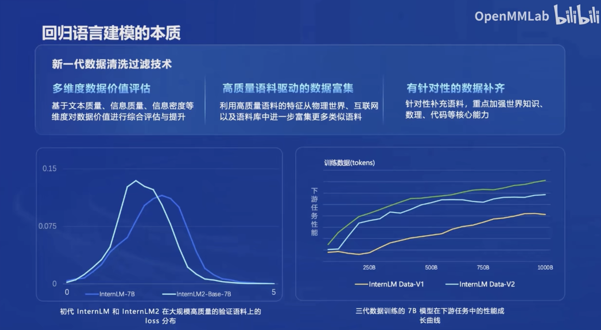
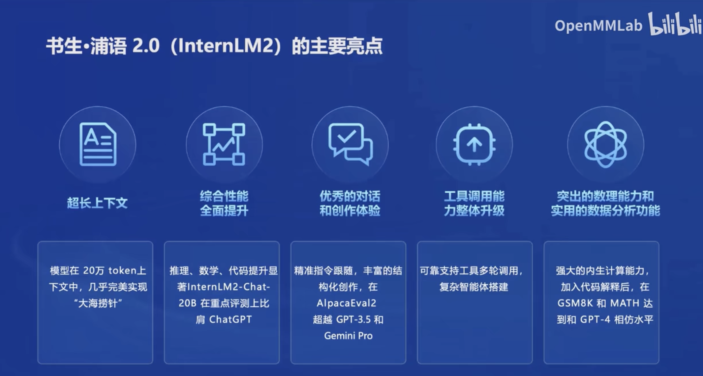
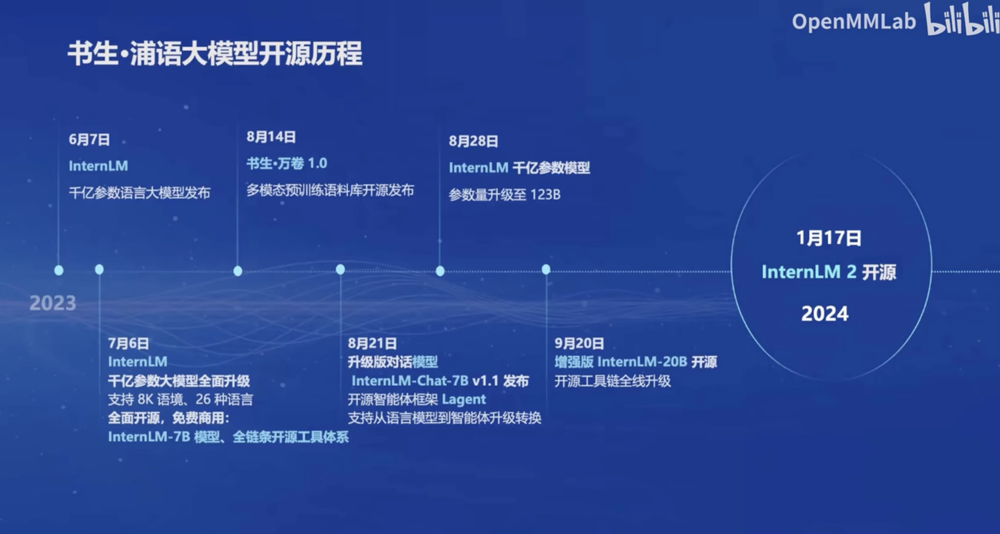
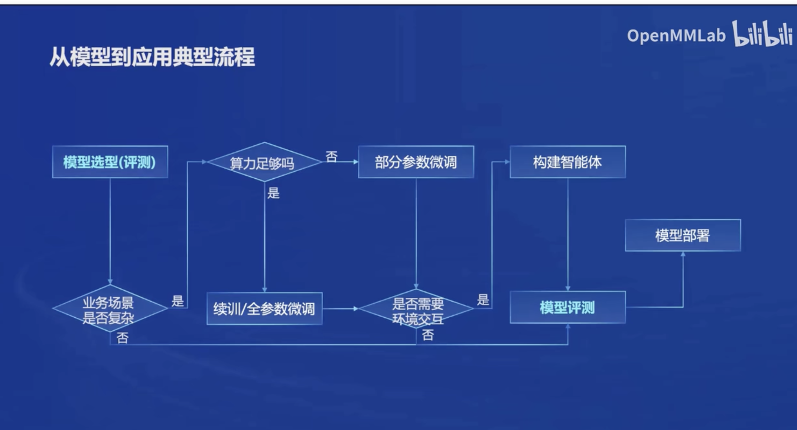
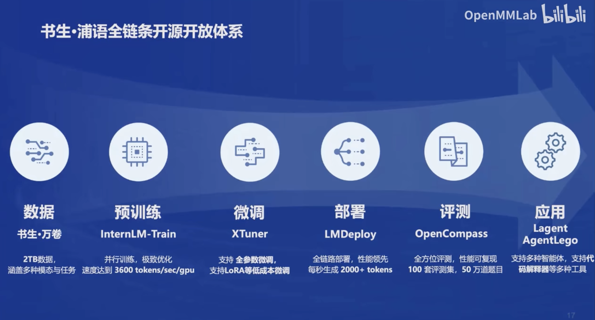
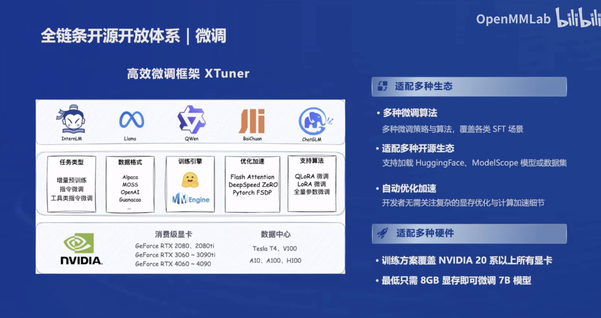

## 版本

- InternLM2-Base：高质量具有可塑性的模型基座，模型进行深度领域适配的高质量起点
- InternLM2：Base基础上，多个能力方向进行强化，评测成绩好，并保持很好的通用语言能力，大部分应用**优秀基座**
- InternLM2-Chat：Base基础上，经过SFT和RLHF，面向对话交换进行优化，具有很好的指令循环、共情聊天和调用工具等的能力

## 回归语言建模的本质

## 书生·浦语的主要亮点

- 超长上下文
- 综合能力的全面提升
- 优秀的对话贺创作体验
- 工具调用能力整体升级
- 突出的数理能力和使用的数据分析功能

## 开源历程

## 数据清洗过滤技术

- 多维度数据价值评估：基于文本质量、信息质量、信息密度等维度对数据价值进行综合评估与提升
- 高质量语料驱动的数据富集：利用高质量语料的特征从物理世界、互联网以及语料库中进一步富集更多类似的语料
- 针对性数据补齐：针对性补充语料，重点加强世界知识、数理、代码等核心能力

## 应用

### 开源开放体系

#### 数据

书生·万卷

#### 预训练

InternLM-Train

#### 微调

XTuner

#### 部署

LMDeploy

#### 评测

OpenCompass

## 应用

Lagent AgentLego

## 轻量智能体框架

- Lagent