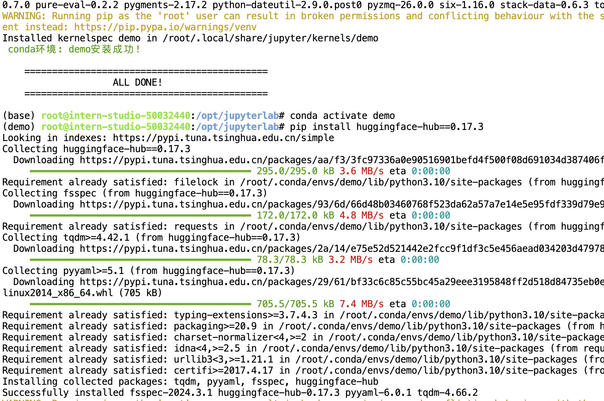
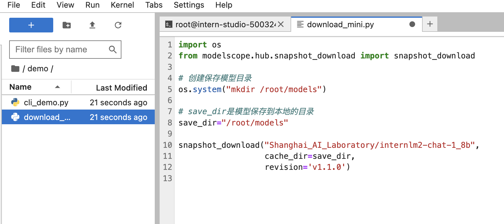
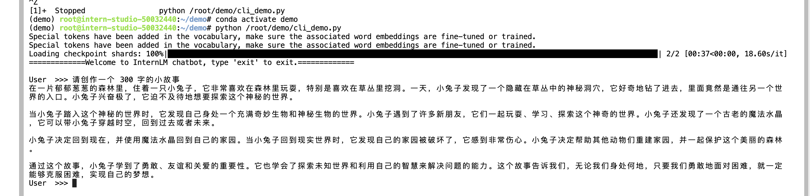

## demo部署

- 部署 InternLM2-Chat-1.8B 模型进行智能对话
- 部署实战营优秀作品 八戒-Chat-1.8B 模型
- 通过 InternLM2-Chat-7B 运行 Lagent 智能体 Demo
- 浦语2 灵笔进行视觉问答和图文生成

### InternLM2-Chat-1.8B 模型进行智能对话，300字小故事

 GitHub上的教程已足够详细，安装过程极其丝滑

 丝滑装完了环境和进入了demo的虚拟环境：

 

一些额外环境包也装完了：

 

讲一个小兔子的故事：

 

