## RAG概述

- 简单来说rag就是在已训练好大模型的基础上增加一个外部数据库，使llm生成的内容在垂直领域达到相应的效果
- 主要目的是降本增效

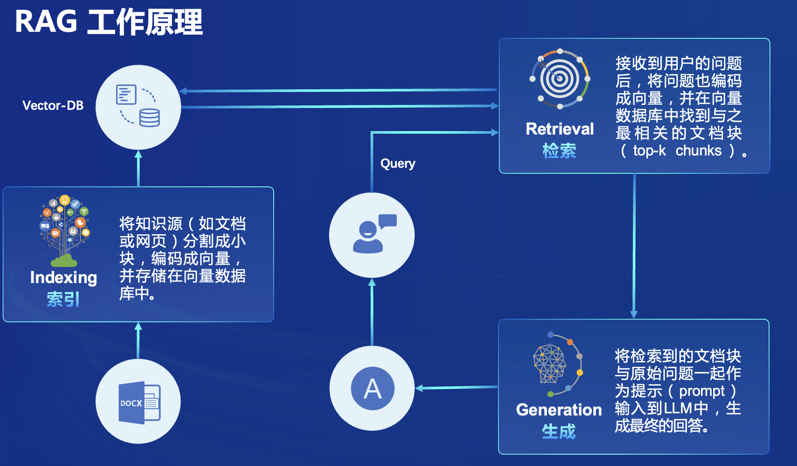

### 可以解决的问题

- 幻觉
- 过时知识
- 缺乏透明和可追溯的推理过程

### 基础效果对比

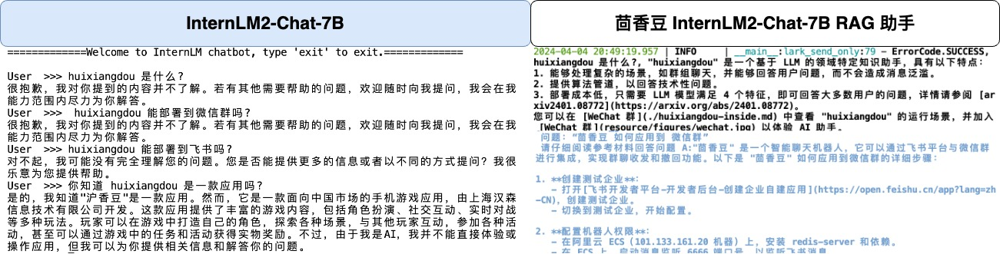

## RAG工作原理

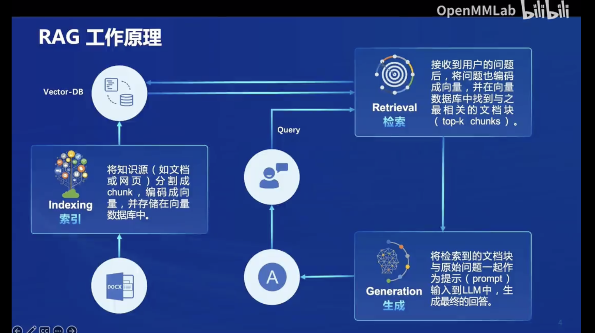

- Indexing
    - docs to Vetor-DB
    Similarity check: cosine distance, dot product

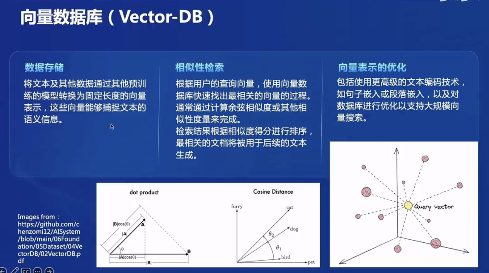

- Retrieval
- Generation

## RAG发展历程

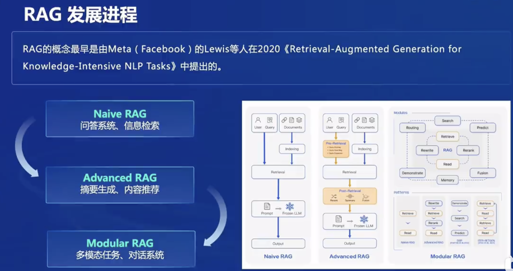

- Naive
- Advanced
- Modular

## RAG常见优化方法

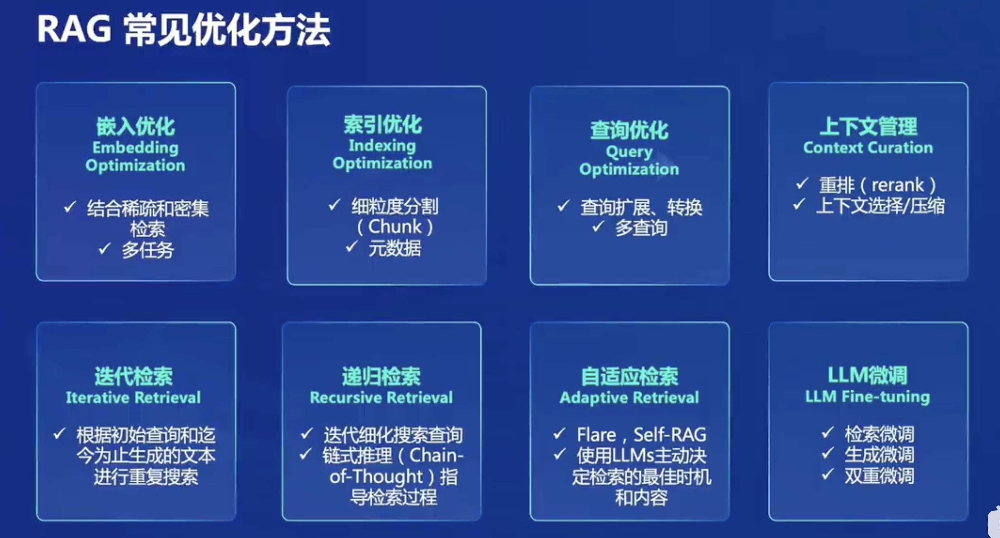

## RAG vs Fine-Tuning

总的来说RAG更加灵活和动态，Fine-tuning高度专业化

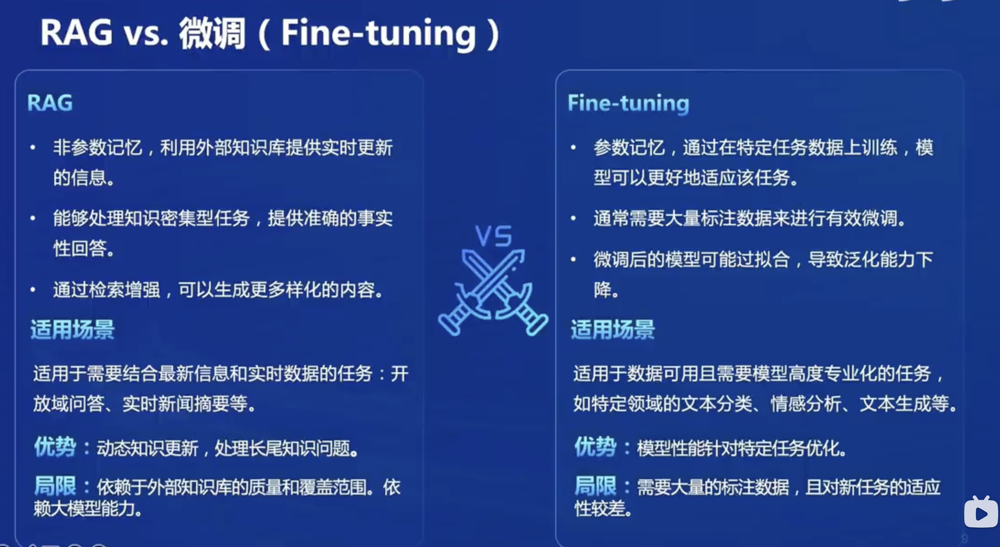

## RAG总结

这个图做的可真好，赏心悦目呢！

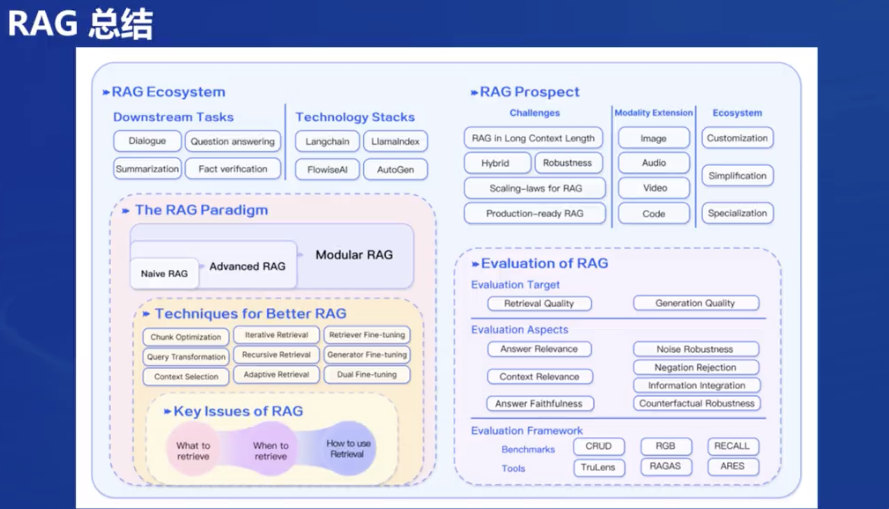

## 作业

- 复制环境，运行虚拟环境

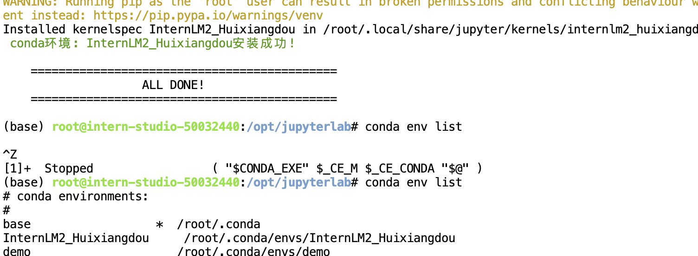

- 装额外的包

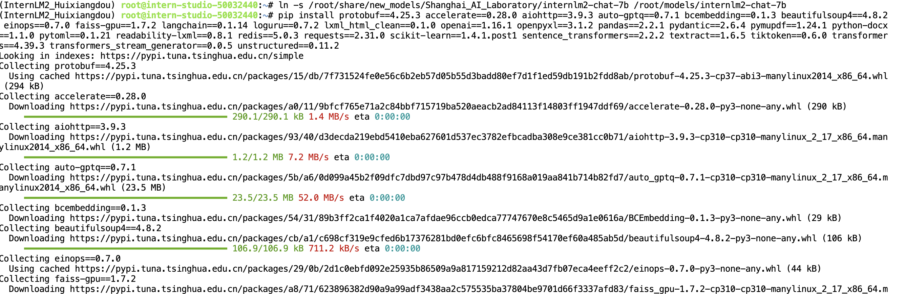

- config里各种model设置好了

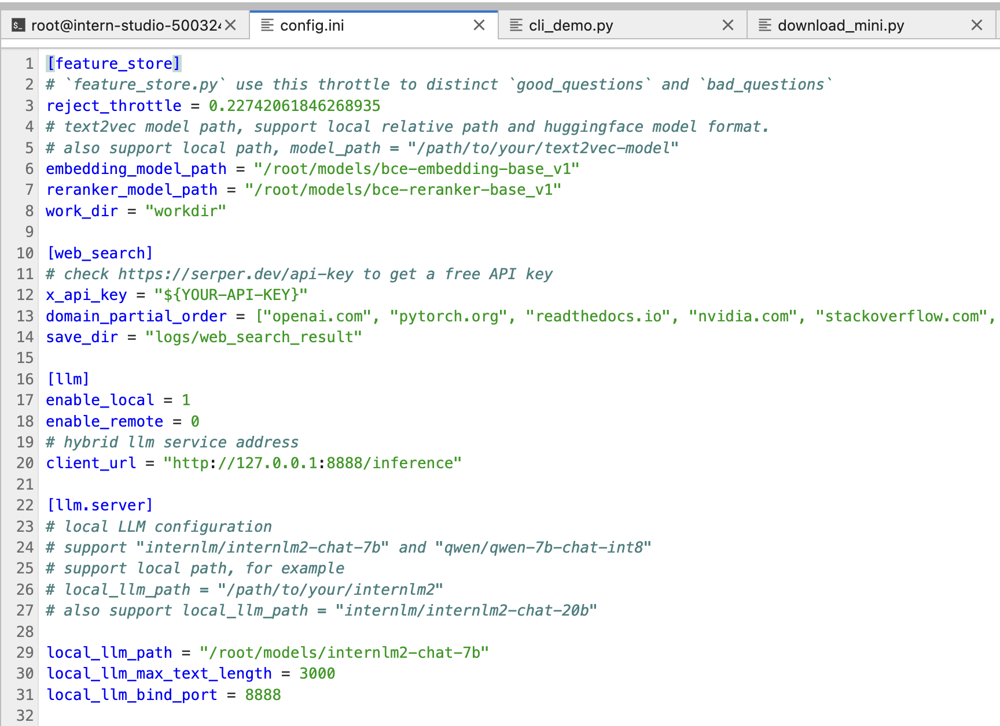

- 创建知识库，回答和拒答的案例问题

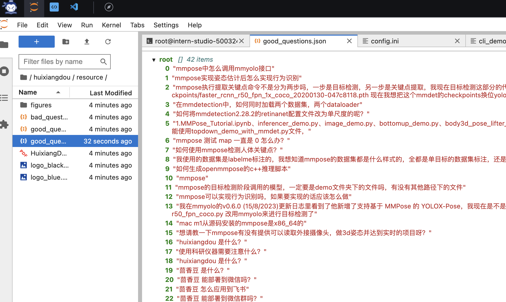

- 测试拒答流程

    - 第一个问题成功了，第二个拒答了

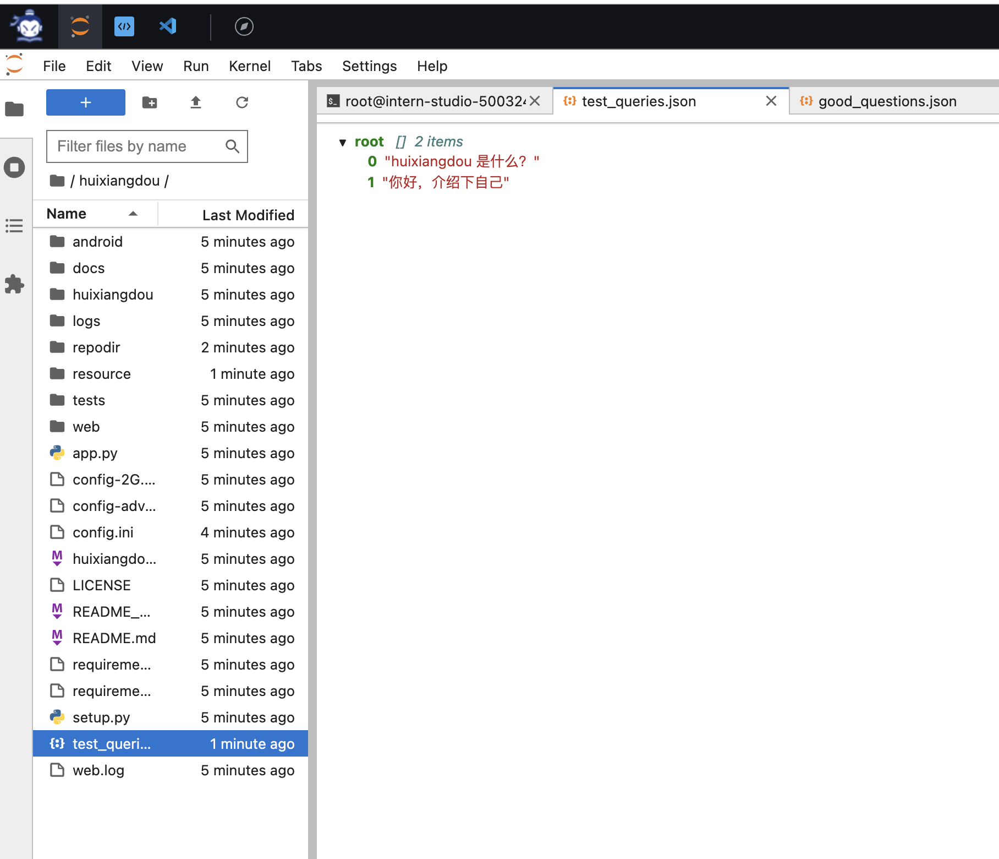
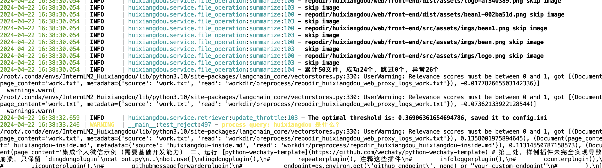
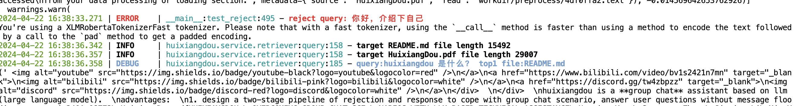

- 第一个问题huixiangdou是什么，
2024-04-22 16:44:43.038 | INFO     | huixiangdou.service.llm_server_hybrid:generate_response:519 - ('“huixiangdou 是什么？”\n请仔细阅读以上内容，判断句子是否是个有主题的疑问句，结果用 0～10 表示。直接提供得分不要解释。\n判断标准：有主语谓语宾语并且是疑问句得 10 分；缺少主谓宾扣分；陈述句直接得 0 分；不是疑问句直接得 0 分。直接提供得分不要解释。', '根据您提供的内容，我无法判断"huixiangdou 是什么？" 这个句子的主题，因为它不包含任何有关于主题的信息。所以，我无法给出 0～10 的分数。请提供更具体的信息，以便我能够更准确地评估。')
2024-04-22 16:44:43.039 | DEBUG    | huixiangdou.service.llm_server_hybrid:generate_response:522 - Q:有主题的疑问句，结果用 0～10 表示。直接提供得分不要解释。
判断标准：有主语谓语宾语并且是疑问句得 10 分；缺少主谓宾扣分；陈述句直接得 0 分；不是疑问句直接得 0 分。直接提供得分不要解释 A:根据您提供的内容，我无法判断"huixiangdou 是什么？" 这个句子的主题，因为它不包含任何有关于主题的信息。所以，我无法给出 0～10 的分数。请提供更具体的信息，以便我能够更准确地评估。                remote local timecost 16.688202142715454 
04/22/2024 16:44:43 - [INFO] -aiohttp.access->>>    127.0.0.1 [22/Apr/2024:16:44:26 +0800] "POST /inference HTTP/1.1" 200 661 "-" "python-requests/2.31.0"
2024-04-22 16:44:45.417 | INFO     | huixiangdou.service.llm_server_hybrid:generate_response:519 - ('告诉我这句话的主题，直接说主题不要解释：“huixiangdou 是什么？”', '主题："huixiangdou" 的含义或定义。')
2024-04-22 16:44:45.418 | DEBUG    | huixiangdou.service.llm_server_hybrid:generate_response:522 - Q:告诉我这句话的主题，直接说主题不要解释：“huixiangdou 是什么？ A:主题："huixiangdou" 的含义或定义。                 remote local timecost 2.1655209064483643 
04/22/2024 16:44:45 - [INFO] -aiohttp.access->>>    127.0.0.1 [22/Apr/2024:16:44:43 +0800] "POST /inference HTTP/1.1" 200 246 "-" "python-requests/2.31.0"
You're using a XLMRobertaTokenizerFast tokenizer. Please note that with a fast tokenizer, using the `__call__` method is faster than using a method to encode the text followed by a call to the `pad` method to get a padded encoding.
2024-04-22 16:44:50.159 | INFO     | huixiangdou.service.retriever:query:158 - target README.md file length 15492
2024-04-22 16:44:50.160 | DEBUG    | huixiangdou.service.retriever:query:185 - query:主题："huixiangdou" 的含义或定义。 top1 file:README.md
2024-04-22 16:44:54.337 | INFO     | huixiangdou.service.llm_server_hybrid:generate_response:519 - ('问题：“huixiangdou 是什么？”\n材料：“ \n</a>\n<a href="https://www.bilibili.com/video/bv1s2421n7mn" target="_blank">\n\n</a>\n<a href="https://discord.gg/tw4zbpzz" target="_blank">\n\n</a>\n
  \n
  \nhuixiangdou is a **group chat** assistant based on llm (large language model).  \nadvantages:  \n1. design a two-stage pipeline of rejection and response to cope with group chat scenario, answer user questions without message flooding, see arxiv2401.08772”\n请仔细阅读以上内容，判断问题和材料的关联度，用0～10表示。判断标准：非常相关得 10 分；完全没关联得 0 分。直接提供得分不要解释。\n', '8')

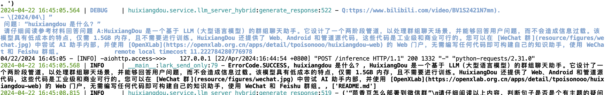
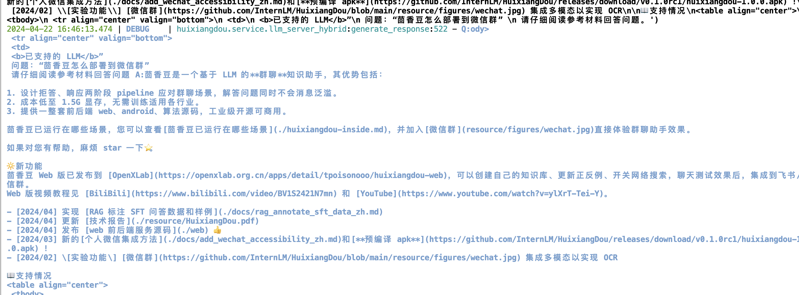
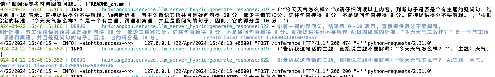

