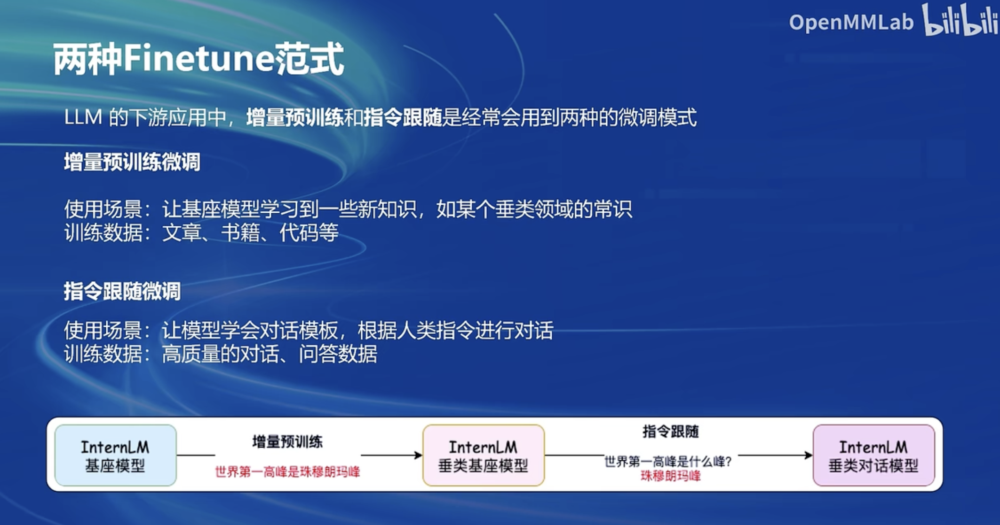

## 两种常见Finetune
- 增量预训练微调，加新知识
- 指令跟随微调，一问一答有监督的标注

对话模板XTuner框架里都包含了，最后的增量预训练微调只对答案部分进行损失计算

## LoRA & QLoRA
lora的adapter参数量远小于原来的linear，减少了显存开销

qlora 4-bit量化模式加载base model，没有那么精确，减少了显存开销

## XTuner
- High-level，轻量级，适配多种生态和硬件

## XTuner快速上手

- 支持工具类模型对话，内置了数据引擎（数据集映射参数）

## 8GB显存LLM

- XTuner内置的两种优化技巧，Flash Attention，DeepSpeed ZeRO

## 多模态LLM

- 原理

- 文本单模态LLM + image projector，LLaVA模型

### 快速上手多模态LLM

給LLM增加视觉能力即训练image projector，两个阶段：Pretrain + Finetune

## 作业

### 一. 环境安装和前期准备

#### 1. 克隆XTuner 的源码，并把相关的配套库也通过 pip 的方式进行了安装

#### 2. 根据自己想要做的事情，利用脚本准备好了一份关于调教模型认识自己身份弟位的数据集

#### 3. 根据自己的显存及任务情况确定了使用 InternLM2-chat-1.8B 这个模型，并且将其复制到我们的文件夹里

#### 4. 在 XTuner 已有的配置文件中，根据微调方法、数据集和模型挑选出最合适的配置文件并复制到我们新建的文件夹中。

### 二. 配置文件修改

### 三. 模型训练

### 四. 模型转换、整合、测试及部署

#### 1. 模型转换

#### 2. 模型整合

#### 3. 对话测试

#### 4. Web demo 部署

