## 0 模型部署

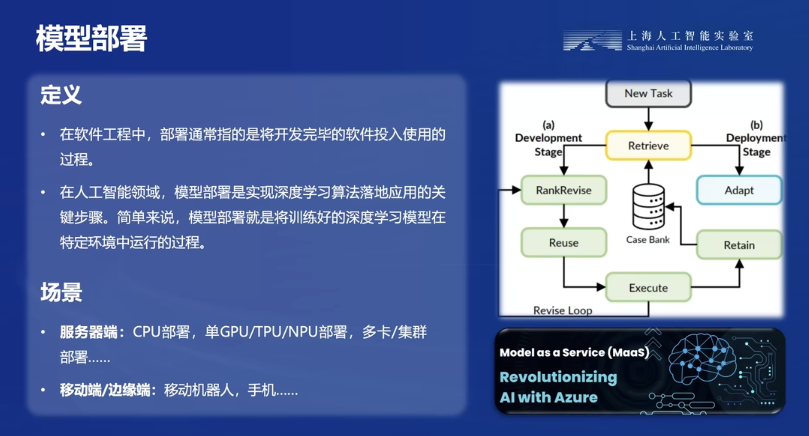

## 1 大模型部署面临的挑战
### 1.1 计算量巨大
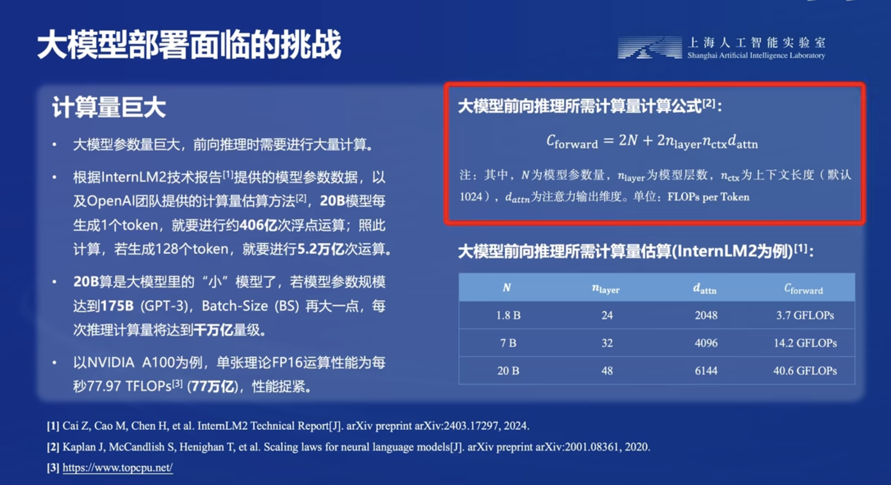

### 1.2 内存开销巨大

根据InternLM2技术报告提供的模型参数数据，以及KV Cache空间估算方法，以FP16为例，在batch-size为16、输入512 tokens、输出32 tokens的情境下，仅20B模型就会产生10.3GB的缓存。

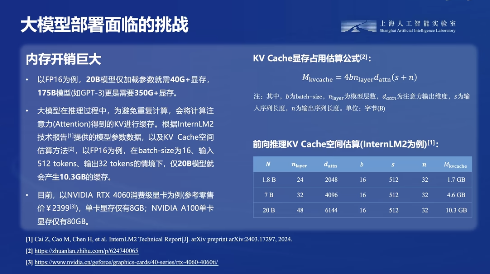

### 1.3 访存瓶颈

大模型推理是“访存密集”型任务。目前硬件计算速度“远快于”显存带宽，存在严重的访存性能瓶颈。以RTX 4090推理175B大模型为例，BS为1时计算量为6.83 TFLOPS，远低于82.58 TFLOPS的FP16计算能力；但访存量为32.62 TB，是显存带宽每秒处理能力的30倍。

- ​动态请求：请求量不确定、请求时间不确定；Token逐个生成，生成数量不确定（生成语句长度不确定，短的需要等待长的，导致GPU利用率不足）。

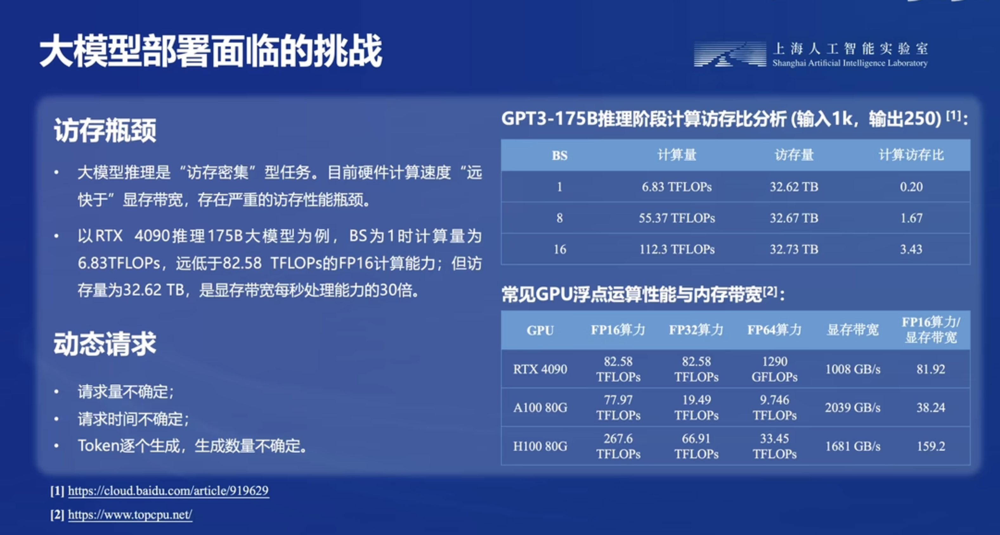

## 2 大模型部署方法

### 2.1 模型剪枝（Pruning）

剪枝指移除模型中不必要或多余的组件，比如参数，以使模型更加高效。通过对模型中贡献有限的冗余参数进行剪枝，在保证性能最低下降的同时，可以减小存储需求、提高计算效率。

- 非结构化剪枝：SparseGPT，LoRAPrune，Wanda
    - 指移除个别参数，而不考虑整体网络结构。这种方法通过将低于阈值的参数置零的方式对个别权重或神经元进行处理。

- 结构化剪枝：LLM-Pruner
    - 根据预定义规则移除连接或分层结构，同时保持整体网络结构。这种方法一次性地针对整组权重，优势在于降低模型复杂性和内存使用，同时保持整体的LLM结构完整。

### 2.2 知识蒸馏（Knowledge Distillation）
​
知识蒸馏是一种经典的模型压缩方法，核心思想是通过引导轻量化的学生模型“模仿”性能更好、结构更复杂的教师模型，在不改变学生模型结构的情况下提高其性能。

- 上下文学习 (ICL)：ICL distillation
- 思维链 (CoT)：MT-COT，Fine-tune-CoT等
- 指令跟随 (IF)：LaMini-LM

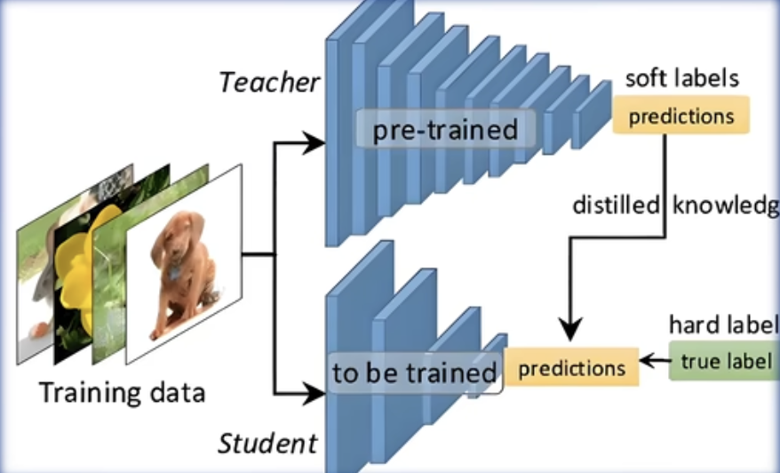

### 2.3 量化（Quantization）
​
量化技术将传统的表示方法中的浮点数转换为整数或其他离散形式，以减轻深度学习模型的存储和计算负担。通过量化可以降低访存瓶颈，从而克服计算过程中定点数转化为浮点数的性能损失。

- 量化感知训练 (QAT)：LLM-QAT：量化目标无缝地集成到模型的训练过程中。这种方法使LLM在训练过程中适应低精度表示。
- 量化感知微调 (QAF)：PEQA，QLoRA：QAF涉及在微调过程中对LLM进行量化。主要目标是确保经过微调的LLM在量化为较低位宽后仍保持性能。
- 训练后量化 (PTQ)：LLM.int8，AWQ：在LLM的训练阶段完成后对其参数进行量化。PTQ的主要目标是减少LLM的存储和计算复杂性，而无需对LLM架构进行修改或进行重新训练。

## 3 LMDeploy
### 简介 & 核心功能

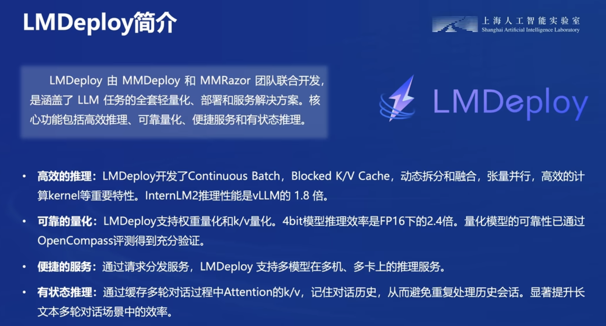
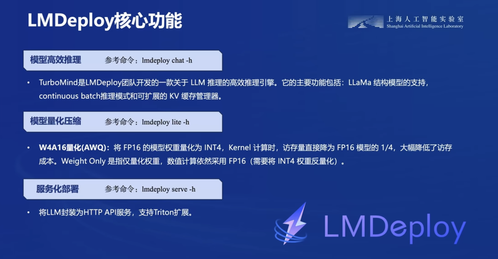

## 作业

### 1 基础环境

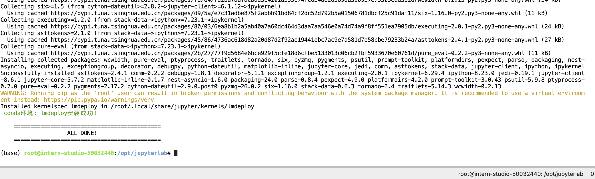
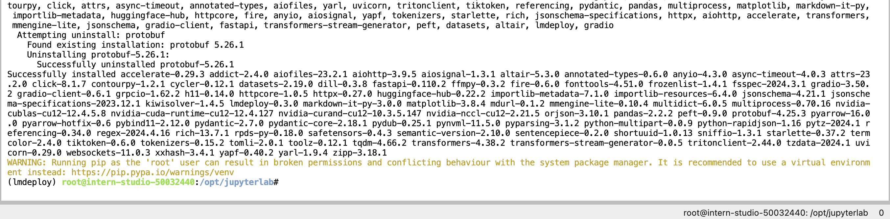

### 2 LMDeploy模型对话(chat)
#### 2.2 下载模型

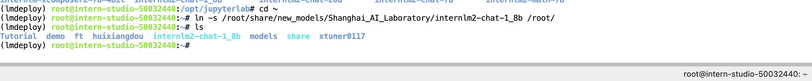

#### 2.3 使用Transformer库运行模型

很慢，8-10min左右
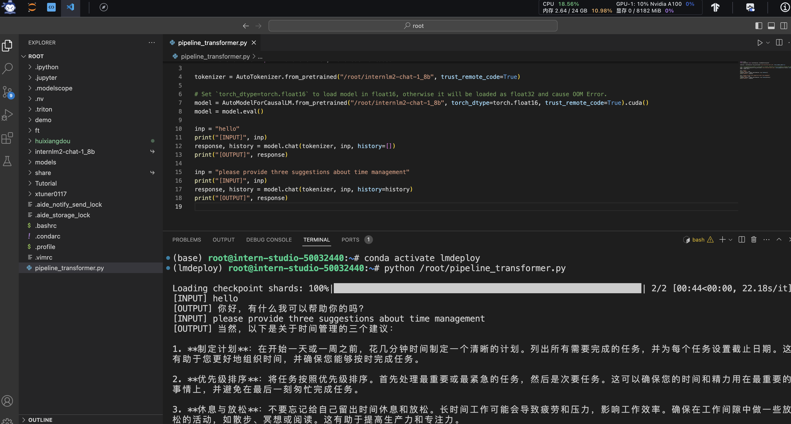

#### 2.4 使用LMDeploy与模型对话

model config:

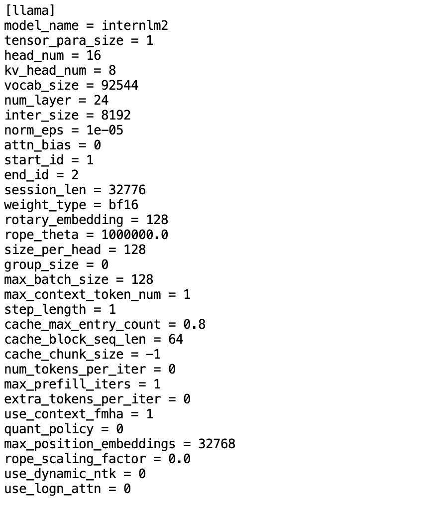

运行时间2-3min，相比Transformer库显著快了，而且讲故事还有一些搞笑成分

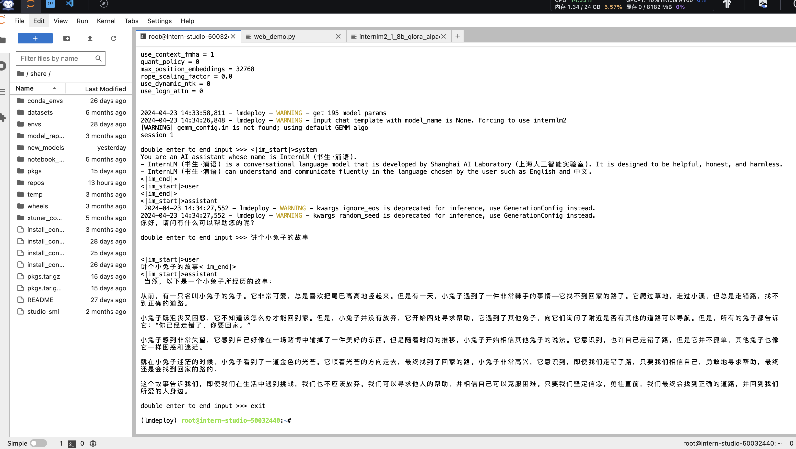

### 3.LMDeploy模型量化(lite)

#### 3.1 设置最大KV Cache缓存大小
模型在运行时，占用的显存可大致分为三部分：模型参数本身占用的显存、KV Cache占用的显存，以及中间运算结果占用的显存

- 首先保持不加该参数（默认0.8），运行1.8B模型。

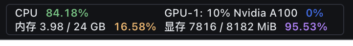

- 改变--cache-max-entry-count参数，设为0.5。

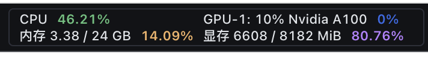

- --cache-max-entry-count参数设置为0.01，约等于禁止KV Cache占用显存。 推理的时候没有很明显的感受到变慢

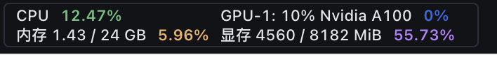

#### 3.2 使用W4A16量化
- 模型量化后，新的HF模型被保存到internlm2-chat-1_8b-4bit目录

- KV Cache比例再次调为0.01，查看显存占用情况

### 4.LMDeploy服务(serve)
#### 4.1 启动API服务器

- 本地需要做一下ssh转发才能直接访问

#### 4.2 命令行客户端连接API服务器
#### 4.3 网页客户端连接API服务器

### 5.Python代码集成
#### 5.1 Python代码集成运行1.8B模型
#### 5.2 向TurboMind后端传递参数

### 6.拓展部分
#### 6.1 使用LMDeploy运行视觉多模态大模型llava

通过ssh转发一下7860端口。

#### 6.2 使用LMDeploy运行第三方大模型