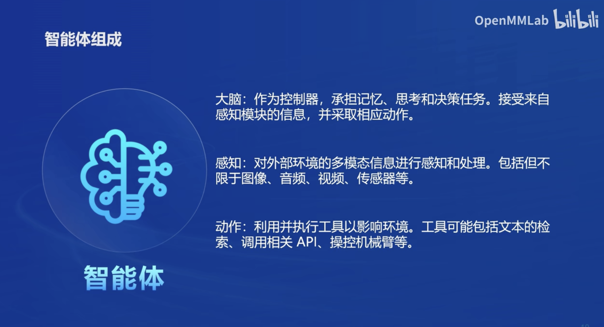
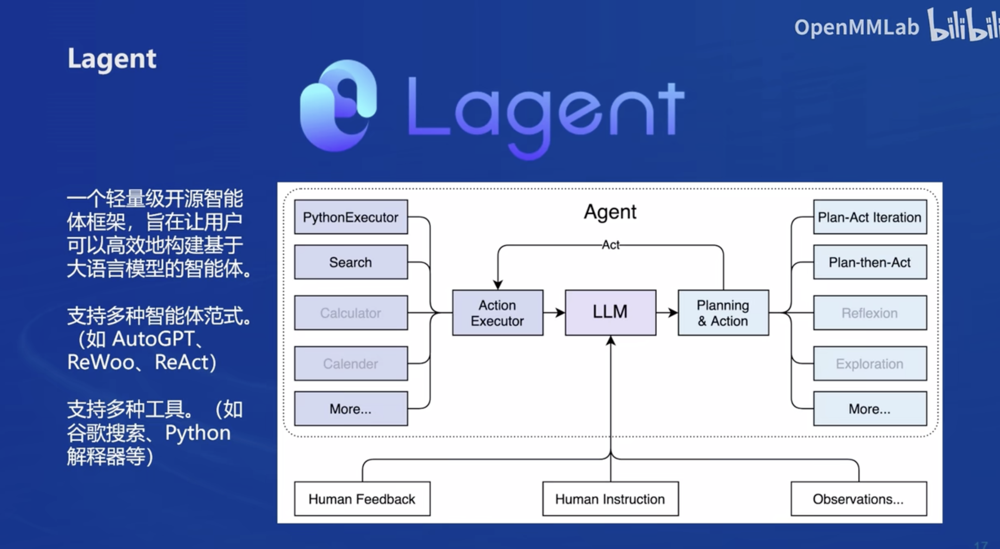
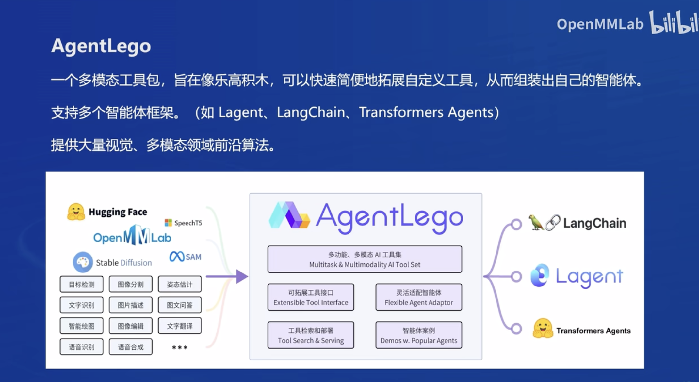
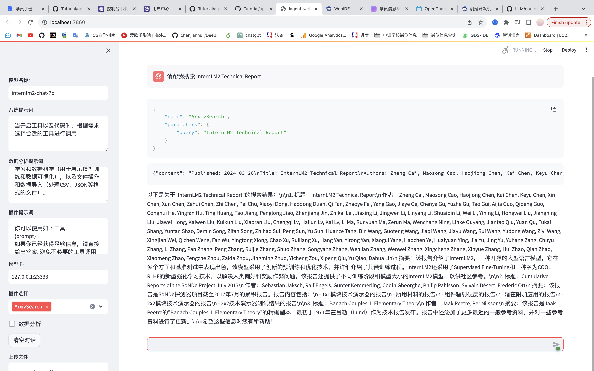
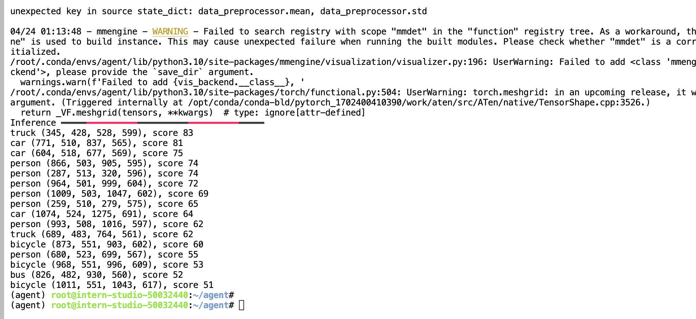
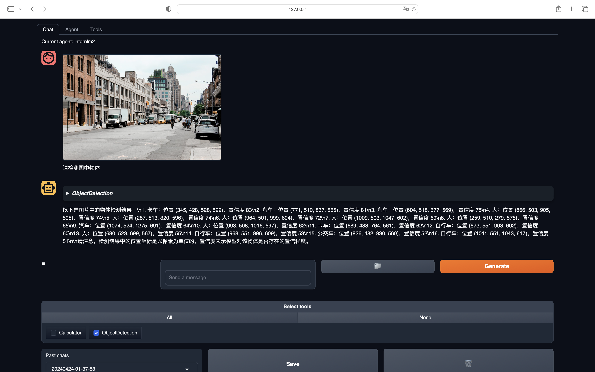
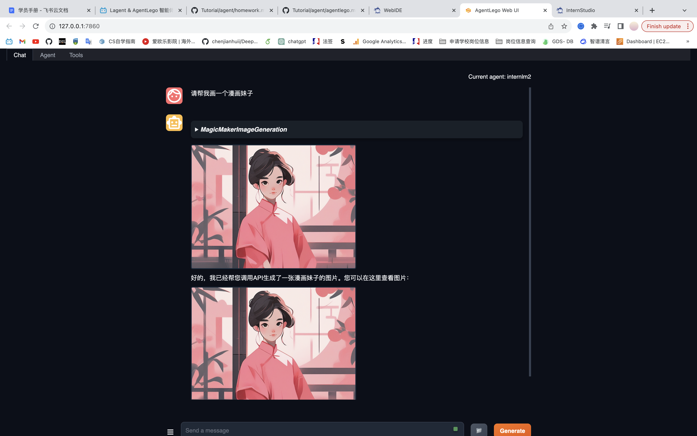

## Agent 理论及 Lagent & AgentLego 

- **Agent 理论**: 介绍了智能体（Agent）的基本概念和作用，以及在大型语言模型（LLM）中的应用。

什么是agent:

agent的组成部分：

- **Lagent**: 一个轻量级开源框架，用于高效构建基于LLM的智能体，支持流式输出和多种模型接口。

Lagent简介

- **AgentLego**: 提供了一系列工具和组件，用于扩展和定制智能体的功能。

## Lagent 调用已有 Arxiv 论文搜索工具实战

- **实战目标**: 使用Lagent框架调用现有的Arxiv论文搜索工具，实现快速检索相关论文。
- **操作步骤**: 展示了如何通过Lagent框架整合Arxiv搜索API，并进行实际操作演示。

## Lagent 新增自定义工具实战（以查询天气的工具为例）

- **实战目标**: 演示如何在Lagent框架中新增自定义工具，以查询天气的工具为例。
- **操作步骤**: 详细介绍了从环境配置、文件修改到运行模型的完整流程。

## AgentLego 新增 MagicMaker 文生图工具实战

- **实战目标**: 介绍AgentLego中的MagicMaker工具，用于生成图像内容。
- **操作步骤**: 通过实战演示了如何使用MagicMaker工具创建文生图，并展示了生成效果。

# 作业

## Lagent Web Demo
### 启动并使用 Lagent Web Demo

## AgentLego
### 直接使用部分

### AgentLego WebUI 使用

### AgentLego 实现自定义工具

