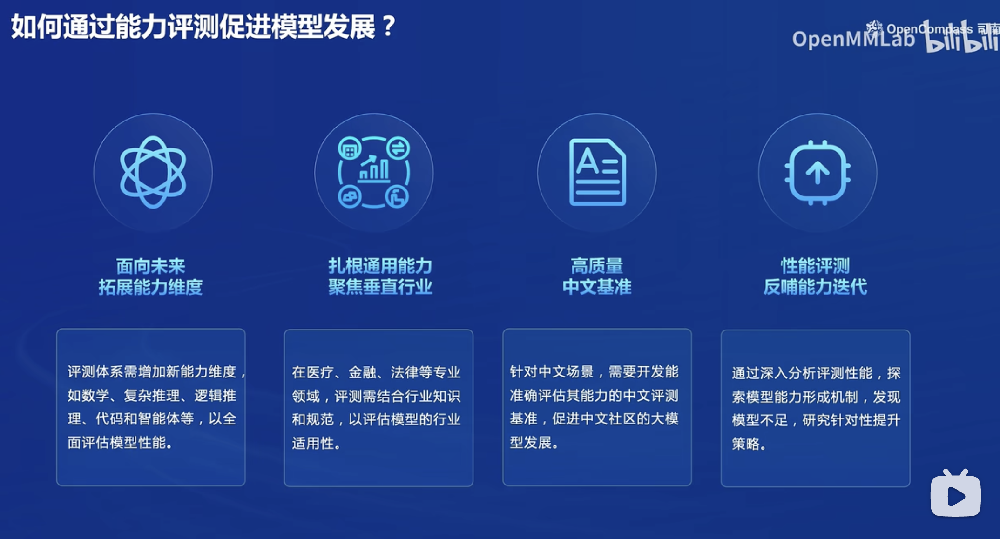
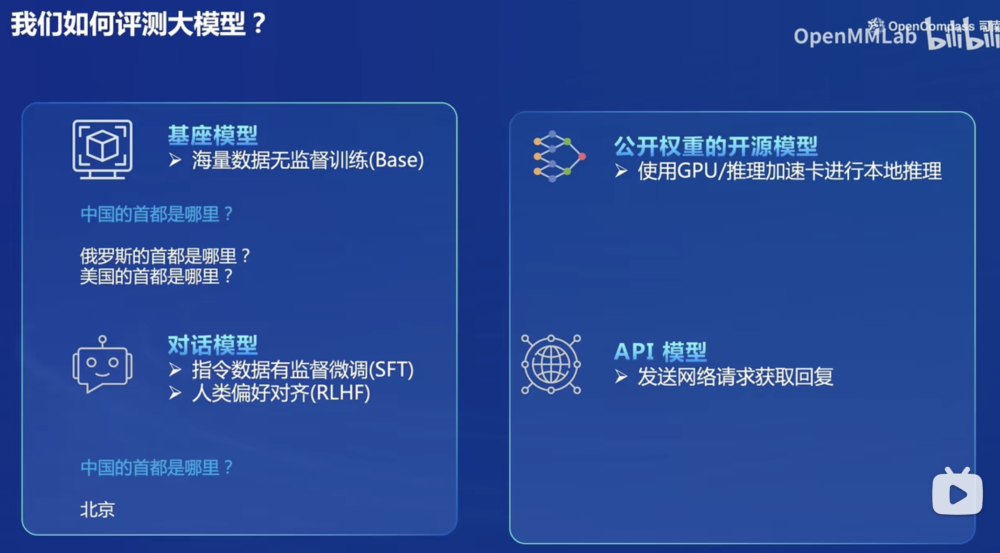
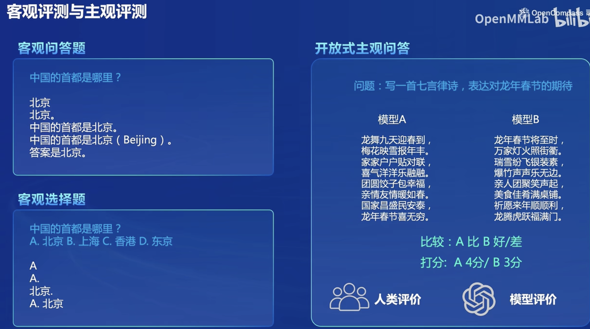
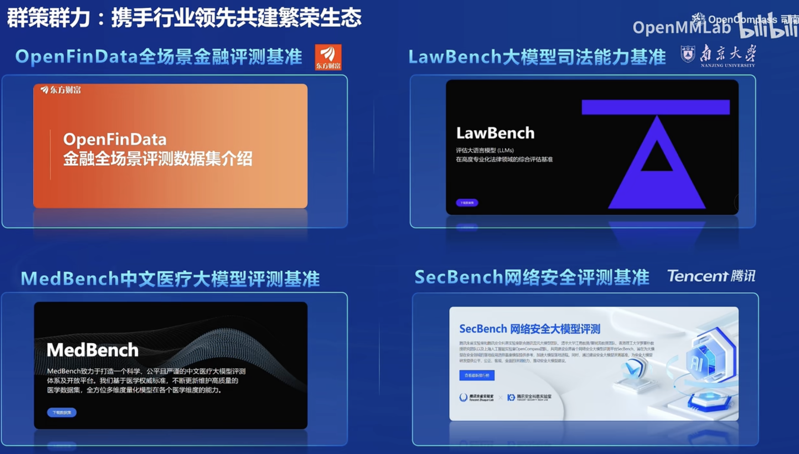
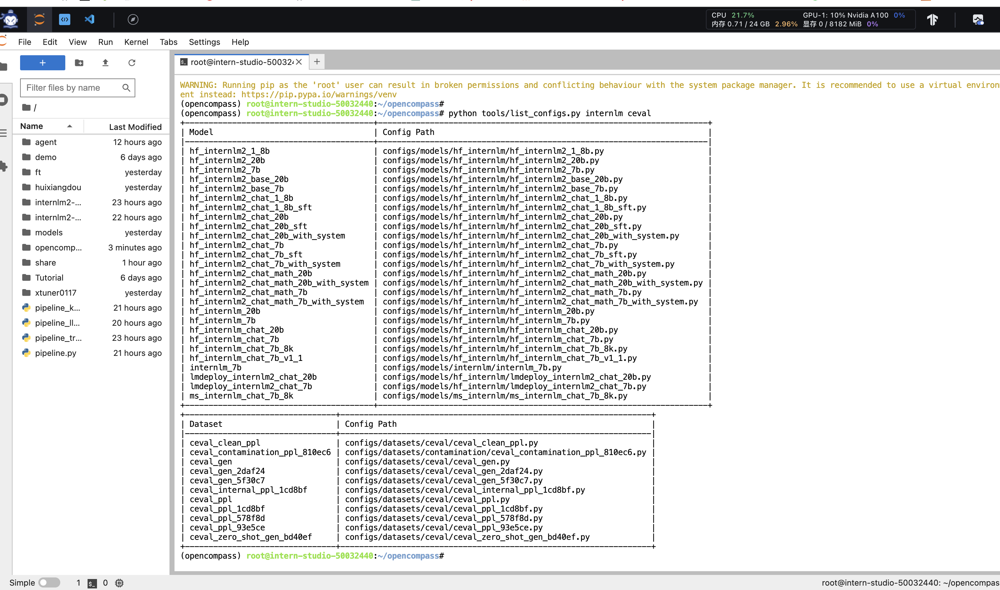
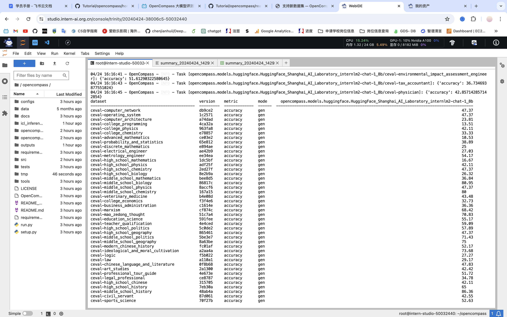

## 进行大模型评测的原因

- 帮助我们更好地理解大模型的长处和短处
- 更好地为人与大模型的协同交互提供指导和帮助
- 更好地统筹和规划大模型未来的发展的演变、防范未知和可能的风险

## 如何评测大模型
### 评测对象
- 基座模型：一般是经过海量的文本数据以自监督学习的方式进行训练获得的模型（如OpenAI的GPT-3，Meta的LLaMA），往往具有强大的文字续写能力。
- 对话模型：一般是在的基座模型的基础上，经过指令微调或人类偏好对齐获得的模型（如OpenAI的ChatGPT、上海人工智能实验室的书生·浦语），能理解人类指令，具有较强的对话能力。
- 公开权重的开源模型
- API模型

## 评测类型
OpenCompass采用客观评测和主观评测相结合的方法。客观评测主要针对具有确定性答案的能力维度和场景，通过构造丰富的评测集来综合评价模型的能力。主观评测则更多地依赖于人的主观感受，用于评估模型的安全性和语言能力。

- 客观评测可以通过定量指标比较模型输出与标准答案的差异来衡量模型的性能。常用的客观评测方式包括判别式评测和生成式评测。
- 主观评测则通过受试者的主观判断来评估具有对话能力的大语言模型。通常会构建主观测试问题集合，并将不同模型对同一问题的回复展示给受试者，收集他们的主观评分。

## OpenCompass
上海人工智能实验室科学家团队正式发布了大模型开源开放评测体系 “司南” (OpenCompass2.0)，用于为大语言模型、多模态模型等提供一站式评测服务。其主要特点如下：

- 开源可复现：提供公平、公开、可复现的大模型评测方案
- 全面的能力维度：五大维度设计，提供 70+ 个数据集约 40 万题的的模型评测方案，全面评估模型能力
- 丰富的模型支持：已支持 20+ HuggingFace 及 API 模型
- 分布式高效评测：一行命令实现任务分割和分布式评测，数小时即可完成千亿模型全量评测
- 多样化评测范式：支持零样本、小样本及思维链评测，结合标准型或对话型提示词模板，轻松激发各种模型最大性能
- 灵活化拓展：增加新模型或数据集, 自定义更高级的任务分割策略，接入新的集群管理系统

### 工具架构

- 模型层：大模型评测所涉及的主要模型种类，OpenCompass以基座模型和对话模型作为重点评测对象。
- 能力层：OpenCompass从本方案从通用能力和特色能力两个方面来进行评测维度设计。在模型通用能力方面，从语言、知识、理解、推理、安全等多个能力维度进行评测。在特色能力方面，从长文本、代码、工具、知识增强等维度进行评测。
- 方法层：OpenCompass采用客观评测与主观评测两种评测方式。客观评测能便捷地评估模型在具有确定答案（如选择，填空，封闭式问答等）的任务上的能力，主观评测能评估用户对模型回复的真实满意度，OpenCompass采用基于模型辅助的主观评测和基于人类反馈的主观评测两种方式。
- 工具层：OpenCompass提供丰富的功能支持自动化地开展大语言模型的高效评测。包括分布式评测技术，提示词工程，对接评测数据库，评测榜单发布，评测报告生成等诸多功能。

## 作业

### 基础作业
使用 OpenCompass 评测 internlm2-chat-1_8b 模型在 C-Eval 数据集上的性能

